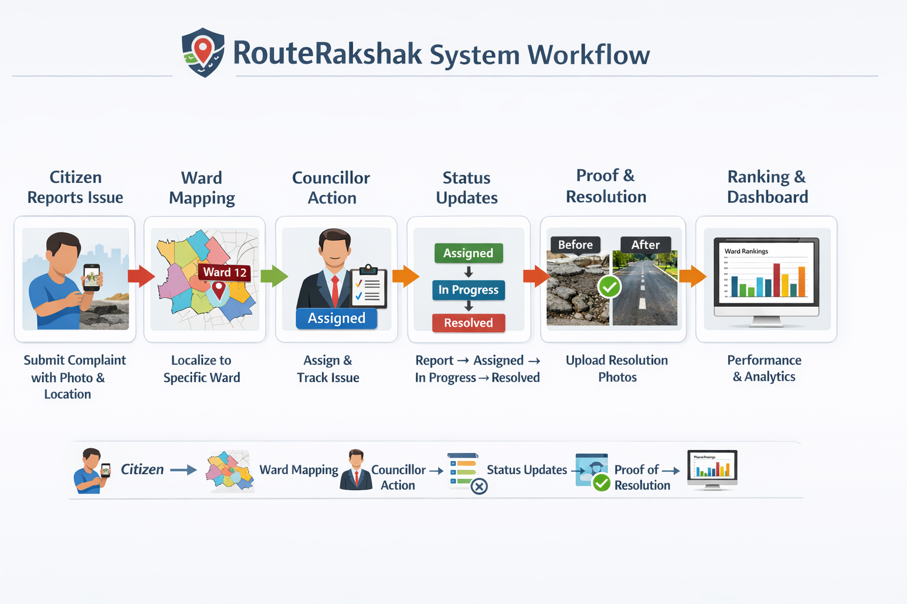
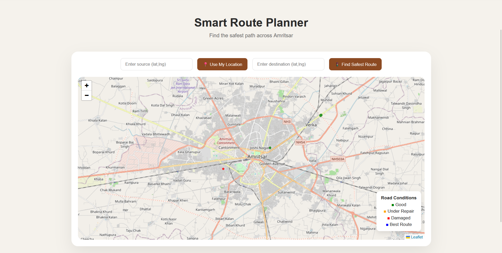

<p align="center">
  
</p>

# 🛣️ Route Rakshak  
### 🚀 Geo-enabled Civic Intelligence Platform for Road Safety


---

## 🌐 Live Demo

- Citizen Portal: https://routerakshak.onrender.com/  
- Admin Panel: https://routerakshakadmin.onrender.com/admin  

---

## 💡 What is Route Rakshak?

Route Rakshak is a **geo-enabled civic intelligence platform** that transforms how urban infrastructure issues are reported, tracked, and resolved.

It bridges the gap between **citizens and municipal authorities** by introducing:

- 📍 Location-based issue reporting  
- 🧠 Data-driven governance insights  
- 🏆 Performance ranking of elected officials  

> Instead of being just a complaint portal, Route Rakshak functions as a **real-time accountability system for city governance**.

---

## 🔥 Why This Project Stands Out

- 🗺️ **Custom-built ward map using QGIS** (no public dataset available)
- 📊 **Performance-based ranking of councillors**
- 🔄 **End-to-end issue lifecycle tracking system**
- 📸 **Proof-based resolution (before/after images)**
- 🧠 Converts raw complaints into **governance intelligence**

---

## 🧠 Core Features

### 👤 Citizen System
- Secure authentication  
- Ward-based complaint submission  
- Real-time issue tracking  
- Image upload for proof  

---

### 🏛️ Administrative System
- Issue assignment & management  
- Status updates (Assigned → In Progress → Resolved)  
- Resolution proof upload  
- Dashboard monitoring  

---

### 🔄 Issue Lifecycle Engine
- Structured workflow:
- Timestamp tracking at every stage  
- Full transparency in issue handling  

---

### 🏆 Performance Ranking System
- Dynamic ward ranking based on:
  - Resolution rate  
  - Response efficiency  
  - Issue handling time  
- Automatically recalculated after each update  
- Encourages accountability and competition  

---

### 🗺️ Geo-Spatial Mapping
- Ward-level visualization  
- Complaint mapping on real city layout  
- Built using **QGIS + custom ward data**  

---

### 📸 Proof-Based Accountability
- Citizens upload issue images  
- Authorities upload resolution proof  
- Before/After comparison ensures transparency  

---

## 📊 System Workflow

Citizen → Complaint Submission → Ward Mapping →  
Councillor Action → Status Update → Ranking Engine → Dashboard Update


---

## 🏗️ System Architecture

### 🔹 Client Layer
- EJS-based UI  
- Handles user interaction and rendering  

### 🔹 Server Layer (Node.js + Express)
- API handling  
- Authentication & session management  
- Complaint processing  
- Ranking logic  

### 🔹 Database Layer (MongoDB)
- Stores users, complaints, wards, rankings  
- Maintains relational data via ObjectIds  

### 🔹 Ranking Engine
- Calculates performance metrics  
- Updates rankings dynamically  
- Ensures consistency  

---

## 📸 Screenshots

### 🗺️ Ward Map


### 📊 Dashboard


### 🚨 Complaint System


---

## 🛠️ Tech Stack

### Backend
- Node.js  
- Express.js  
- MongoDB  
- Mongoose  

### Frontend
- EJS  
- HTML, CSS, JavaScript  

### Security
- bcrypt  
- express-session  

### Deployment
- Render  

---

## ⚙️ Setup Instructions

```bash
git clone https://github.com/Tejwardeep-Singh/RouteRakshak.git
cd RouteRakshak
npm install

# create env

  MONGO_URI=your_mongodb_connection_string
  SESSION_SECRET=your_secret_key
  CLOUD_NAME=CloudName
  CLOUD_API_KEY=CloudApiKey
  CLOUD_API_SECRET=CloudApiSecret

  cd backend
  npx nodemon app-citizen.js
  npx nodemon app-admin.js

Future Enhancements
  AI-based complaint prioritization
  Real-time analytics dashboard
  Mobile application
  Geo-fencing for automatic ward detection
  Predictive infrastructure analysis

🌍 Impact

  Route Rakshak enables:
    - Faster issue resolution
    - Transparent governance
    - Data-driven decision making
    - Stronger citizen participation

🧠 Engineering Highlights
  - Designed a scalable complaint lifecycle system  
  - Built a dynamic ranking engine for governance evaluation  
  - Integrated geo-spatial ward mapping using QGIS  
  - Implemented role-based access for citizens and administrators  

 👥 Team

- Tejwardeep Singh – Lead Backend Developer  
- Eklavya – Backend Developer  
- Snehdeep Kaur – UI/UX Designer  
- Aemryene Sandhu – UI/UX Designer  

> Led backend development, system architecture, and ranking engine design.